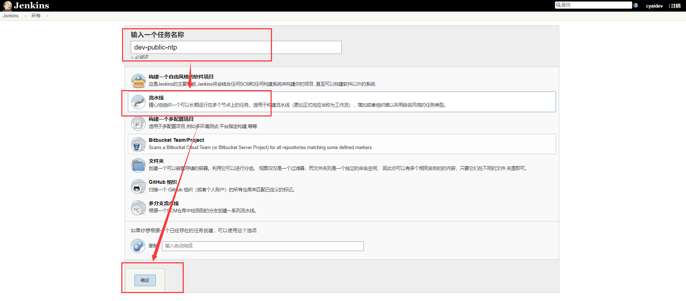
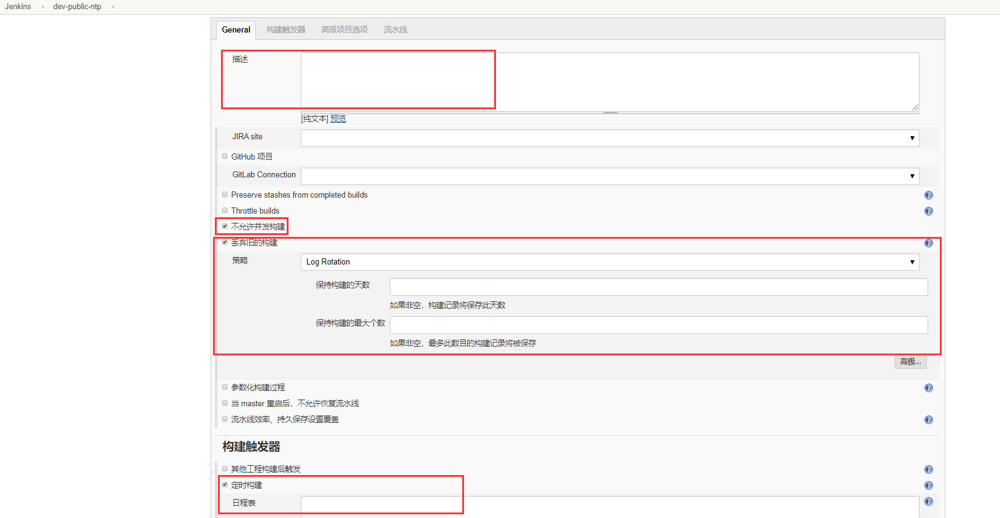
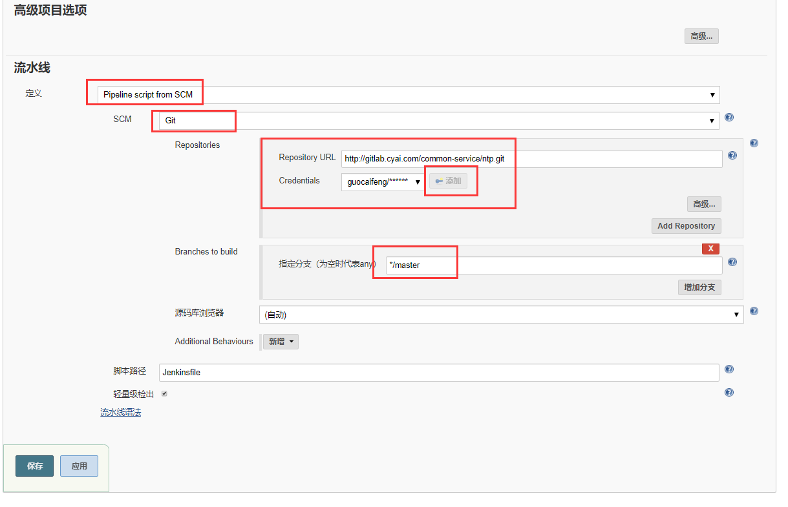
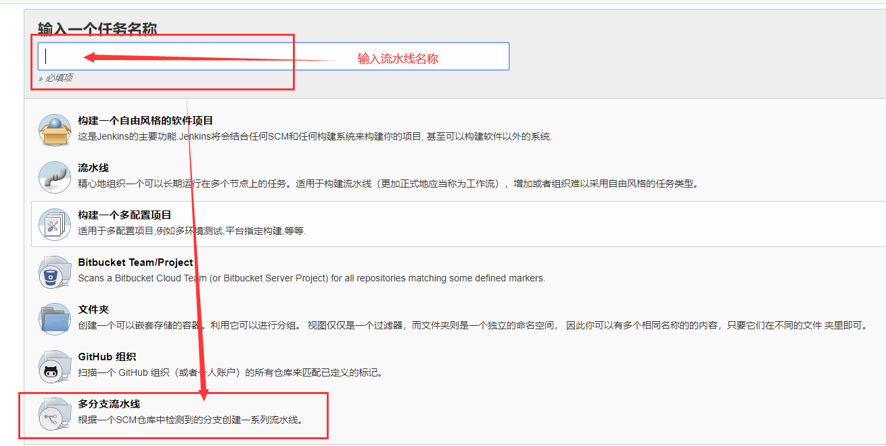
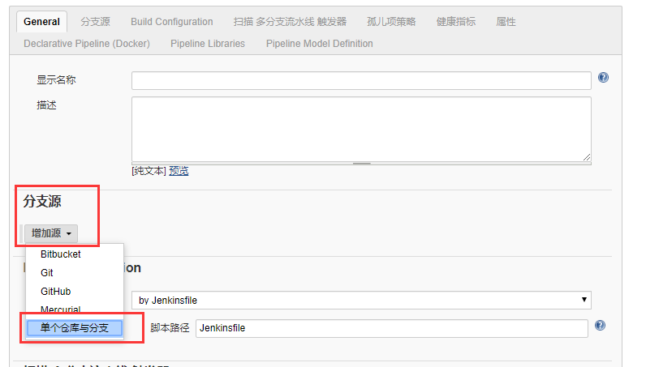
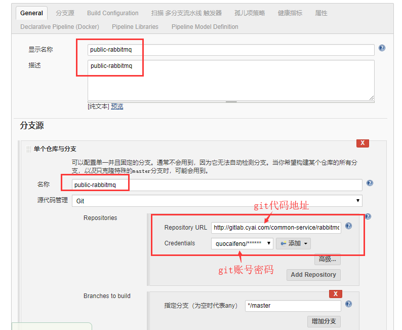
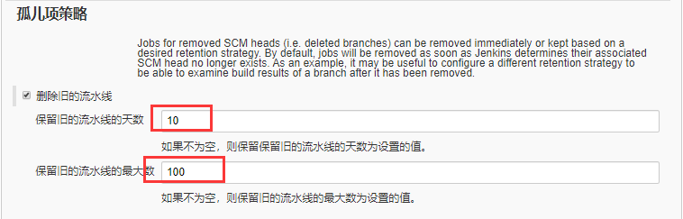

# 基础信息

**示例账号：cyaidev/cyaipaas**

## 1.1 新建流水线任务

### 1.1.1 新建流水线任务

### 1.1.2 完善相关信息

### 1.1.3 点击保存，项目创建完成，剩下的需要更改项目的Jenkinsfile来实现   

## 1.2 新建多分支任务

### 1.2.1 新建多分支流水线任务

### 1.2.2 添加分支源   

### 1.2.3 添加其他信息    
> Branchs to build 只能添加分支,不能添加标签

### 1.2.4点击保存，项目创建完成，剩下的需要更改项目的Jenkinsfile来实现   
