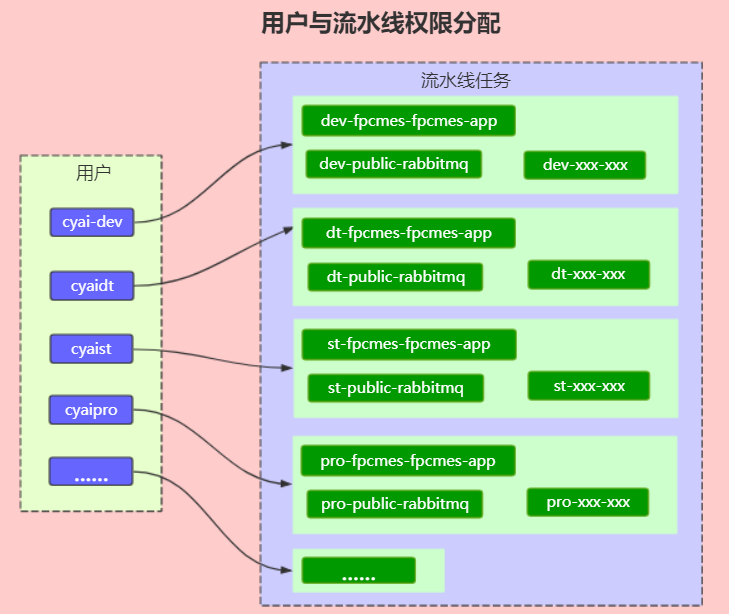
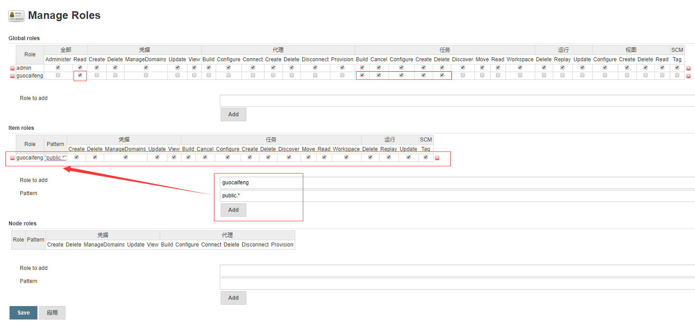
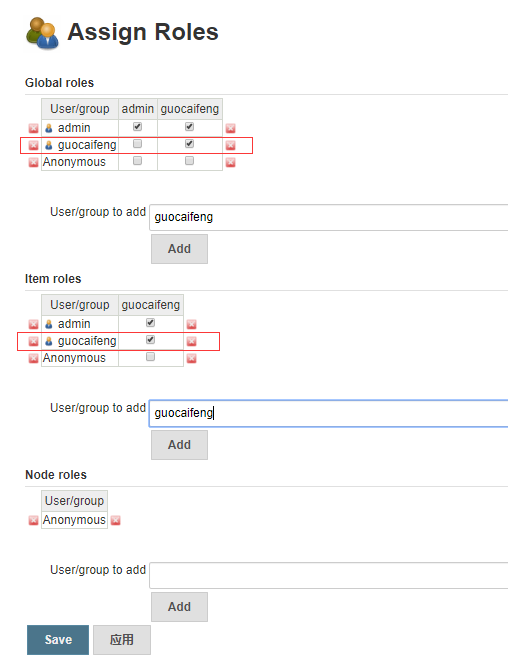

# 1 新建项目，如何对项目以及用户授予管理权限

## 1.1 添加用户
打开系统管理->管理用户->新建用户

## 1.2 配置ManageRoles
打开系统管理->Manage and Assign Roles->Manage Roles  
> admin全部选中，其他用户只能选中user/group交集位置  
> Pattern 需要按照正则匹配的方式,进行项目权限分配. 例如：public.*只能查看public开头的任务

1.添加Global roles  
2.添加Item roles  

## 1.3 配置AssignRoles
打开系统管理->Manage and Assign Roles->Assign Roles   
> admin全部选中，其他用户只能选中user/group交集位置  

1.添加Global roles  
2.添加Item roles   
   

## 1.4 验证结果   
guocaifeng用户登录后，只能操作public开头的项目。
