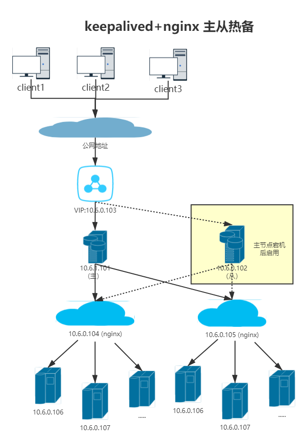

# 1 基础信息
## 1.1 基础软件信息

基础软件 | 版本 | 备注
---|---|--- 
ubuntu | 18.04 LTS | 无
nginx | 1.14.0 (Ubuntu) |  无
Keepalived | v1.3.9 (10/21,2017) |  无

## 1.2 服务器信息

用途 | IP | 备注
---|---|--- 
Master | 10.6.0.101 | 无
Slave | 10.6.0.102 |  无
VIP | 10.6.0.103 |  无
nginx1 | 10.6.0.104 |  无
nginx2 | 10.6.0.105 |  无

# 2 应用架构


# 3 初始化服务器

## 3.1 所有服务器执行
```
# 执行如下操作应该是需要root权限

cat > /etc/apt/source.list << EOF
deb http://mirrors.aliyun.com/ubuntu/ xenial main
deb-src http://mirrors.aliyun.com/ubuntu/ xenial main
deb http://mirrors.aliyun.com/ubuntu/ xenial-updates main
deb-src http://mirrors.aliyun.com/ubuntu/ xenial-updates main
deb http://mirrors.aliyun.com/ubuntu/ xenial universe
deb-src http://mirrors.aliyun.com/ubuntu/ xenial universe
deb http://mirrors.aliyun.com/ubuntu/ xenial-updates universe
deb-src http://mirrors.aliyun.com/ubuntu/ xenial-updates universe
deb http://mirrors.aliyun.com/ubuntu/ xenial-security main
deb-src http://mirrors.aliyun.com/ubuntu/ xenial-security main
deb http://mirrors.aliyun.com/ubuntu/ xenial-security universe
deb-src http://mirrors.aliyun.com/ubuntu/ xenial-security universe
EOF

# 更新服务器软件
sudo apt update

# 安装net-tools工具
sudo apt install -y net-tools

```
## 3.2 Master和Slave执行：
```
# 安装ipvs 和 keepalived
sudo apt-get install -y ipvsadm keepalived

# 加载内核模块
modprobe ip_vs 
lsmod|grep ip_vs

```
## 3.3 Nginx1和Nginx2执行：
### 3.3.1 nginx服务安装和配置
```
# 安装nginx服务
sudo apt-get install -y nginx

# 查找nginx的默认配置文件位置
root@ubuntu:~# sudo cat /etc/nginx/nginx.conf | grep include
include /etc/nginx/modules-enabled/*.conf;
	include /etc/nginx/mime.types;
	include /etc/nginx/conf.d/*.conf;
	include /etc/nginx/sites-enabled/*;
# 修改配置信息
root@ubuntu:~# ls /etc/nginx/sites-enabled
default
# 将端口80改为8080后重启服务器
systemctl restart nginx

# 将nginx1中的html文件改为
echo "app1" > /var/www/html/index.nginx-debian.html

# 将nginx2中的html文件改为
echo "app2" > /var/www/html/index.nginx-debian.html

# 分别在nginx1和nginx2执行
curl localhost:8080
```
### 3.3.2 添加路由信息(为keepalived服务，只做了一个系统服务)
(1) 创建目录和文件
```
mkdir -p /etc/realserver && touch /etc/realserver/init_net.sh 
```
(2) 在文件中写入如下内容  

SNS_VIP=10.6.0.103 这里填写虚拟IP地址   
lo:1  开启本地回环网络  1 可以改为其他数值
```
cat > /etc/realserver/init_net.sh <<EOF
#!/bin/bash
SNS_VIP=10.6.0.103 #定义了一个VIP变量，必须跟真是服务在一个网段
case "\$1" in  
start)
echo "start realserver"  
/sbin/ifconfig lo:1 \$SNS_VIP up
echo "1" >/proc/sys/net/ipv4/conf/lo/arp_ignore  
echo "2" >/proc/sys/net/ipv4/conf/lo/arp_announce  
echo "1" >/proc/sys/net/ipv4/conf/all/arp_ignore  
echo "2" >/proc/sys/net/ipv4/conf/all/arp_announce  
;;  
stop)
echo "stop realserver"   
/sbin/ifconfig lo:1 down  
echo "0" >/proc/sys/net/ipv4/conf/lo/arp_ignore  
echo "0" >/proc/sys/net/ipv4/conf/lo/arp_announce  
echo "0" >/proc/sys/net/ipv4/conf/all/arp_ignore  
echo "0" >/proc/sys/net/ipv4/conf/all/arp_announce  
;;
restart)
echo "restart realserver"   
/sbin/ifconfig lo:1 \$SNS_VIP up
echo "1" >/proc/sys/net/ipv4/conf/lo/arp_ignore  
echo "2" >/proc/sys/net/ipv4/conf/lo/arp_announce  
echo "1" >/proc/sys/net/ipv4/conf/all/arp_ignore  
echo "2" >/proc/sys/net/ipv4/conf/all/arp_announce
/sbin/ifconfig lo:1 down  
echo "0" >/proc/sys/net/ipv4/conf/lo/arp_ignore  
echo "0" >/proc/sys/net/ipv4/conf/lo/arp_announce  
echo "0" >/proc/sys/net/ipv4/conf/all/arp_ignore  
echo "0" >/proc/sys/net/ipv4/conf/all/arp_announce 
/sbin/ifconfig lo:1 \$SNS_VIP up
echo "1" >/proc/sys/net/ipv4/conf/lo/arp_ignore  
echo "2" >/proc/sys/net/ipv4/conf/lo/arp_announce  
echo "1" >/proc/sys/net/ipv4/conf/all/arp_ignore  
echo "2" >/proc/sys/net/ipv4/conf/all/arp_announce
;; 
*)
echo "Usage: systemctl {start|stop|restart} realserver"  
exit 1  
esac
EOF

```
(3) 添加可执行权限
```
chmod +x /etc/realserver/init_net.sh
```
(4) 编写开机服务
```
touch /lib/systemd/system/realserver.service

cat > /lib/systemd/system/realserver.service <<EOF
[Unit]
Description="my define realserver serivce"
After=network.target

[Service]
Type=forking
ExecStart=/etc/realserver/init_net.sh start
ExecStop=/etc/realserver/init_net.sh stop
ExecReload=/etc/realserver/init_net.sh restart
TimeoutSec=0
RemainAfterExit=yes
GuessMainPID=no

[Install]
WantedBy=multi-user.target
EOF

# 验证测试
systemctl restart realserver
systemctl status realserver

# 添加开机启动
systemctl enable realserver
```
(4) 测试验证，发现多了如下内容，验证通过
```
root@ubuntu:~# ifconfig lo:1
lo:1: flags=73<UP,LOOPBACK,RUNNING>  mtu 65536
        inet 10.6.0.103  netmask 255.0.0.0
        loop  txqueuelen 1000  (Local Loopback)
```


# 4 keepalived配置
## 4.1 Master配置
主备不一定的地方：   
state MASTER  BACKUP
router_id lvs1  lvs2
priority 150  80

```
cat > /etc/keepalived/keepalived.conf <<EOF
global_defs {
    router_id lvs1
}

vrrp_instance LVS {
	state MASTER
	interface ens33
	virtual_router_id 51
	priority 150
	advert_int 1
	authentication {
		auth_type PASS
		auth_pass 123456
	}
	virtual_ipaddress {
		10.6.0.103
	}
}

virtual_server 10.6.0.103 8080 {
	delay_loop 1
	lb_algo wrr
	lb_kind DR
	persistence_timeout 60
	protocol TCP
	
	real_server 10.6.0.104 8080 {
		weight 1
		HTTP_GET {
            url {
                path /
                status_code 200
            }
            connect_timeout 3
            nb_get_retry 3
            delay_before_retry 3
        }
    }
    real_server 10.6.0.105 8080 {
        weight 1
        HTTP_GET {
            url {
                path /
                status_code 200
            }
            connect_timeout 3
            nb_get_retry 3
            delay_before_retry 3
        }
    }
}
EOF

```

## 4.2 Slave配置
```
cat > /etc/keepalived/keepalived.conf <<EOF
global_defs {
	router_id lvs2
}

vrrp_instance LVS {
	state BACKUP
	interface ens33
	virtual_router_id 51
	priority 80
	advert_int 1
	authentication {
		auth_type PASS
		auth_pass 123456
	}
	virtual_ipaddress {
		10.6.0.103
	}
}

virtual_server 10.6.0.103 8080 {
	delay_loop 1
	lb_algo wrr
	lb_kind DR
	persistence_timeout 60
	protocol TCP
	
	real_server 10.6.0.104 8080 {
		weight 1
		HTTP_GET {
            url {
              	path /
              	status_code 200
            }
            connect_timeout 3
            nb_get_retry 3
            delay_before_retry 3
    	}
    }
    real_server 10.6.0.105 8080 {
        weight 1
        HTTP_GET {
            url {
              	path /
              	status_code 200
            }
            connect_timeout 3
            nb_get_retry 3
            delay_before_retry 3
        }
    }
}
EOF
```

## 4.3 重启并添加开机启动
```
systemctl restart keepalived
systemctl enable keepalived
```

# 5 测试验证
找一个服务器当做Clinet用来监控应用是否可以访问
```
while true;do curl 10.6.0.103:8080; sleep 1; done
```

## 5.1 启动master，停掉slave，停掉nginx1，可以看到nginx1 104服务器已经被剔除路由，此时只能访问nginx2
```
# 在Master上查看路由信息
root@ubuntu:/lib/systemd/system# ipvsadm -Ln
IP Virtual Server version 1.2.1 (size=4096)
Prot LocalAddress:Port Scheduler Flags
  -> RemoteAddress:Port           Forward Weight ActiveConn InActConn
TCP  10.6.0.103:8080 wrr persistent 60
  -> 10.6.0.105:8080              Route   1      2          0 

# 在Master上可以看到 10.6.0.103
root@ubuntu:/etc/keepalived# ip a
2: ens33: <BROADCAST,MULTICAST,UP,LOWER_UP> mtu 1500 qdisc fq_codel state UP group default qlen 1000
    link/ether 00:0c:29:d8:2d:a3 brd ff:ff:ff:ff:ff:ff
    inet 10.6.0.101/16 brd 10.6.255.255 scope global noprefixroute ens33
       valid_lft forever preferred_lft forever
    inet 10.6.0.103/32 scope global ens33
       valid_lft forever preferred_lft forever
    inet6 fe80::529d:ff58:711b:b04d/64 scope link noprefixroute 
       valid_lft forever preferred_lft forever

# 恢复nginx1，在Master可以看到104路由已经添加到系统中，此时可以看到nginx1和nginx2，但是因为有负载均衡策略，会存在无法立即切换到nginx1的情况
root@ubuntu:/lib/systemd/system# ipvsadm -Ln
IP Virtual Server version 1.2.1 (size=4096)
Prot LocalAddress:Port Scheduler Flags
  -> RemoteAddress:Port           Forward Weight ActiveConn InActConn
TCP  10.6.0.103:8080 wrr persistent 60
  -> 10.6.0.104:8080              Route   1      0          0         
  -> 10.6.0.105:8080              Route   1      2          0 
```
## 5.2 启动slave，停掉Master，系统依然可以正常访问
```
# 在Slave上查看路由信息
root@ubuntu:/lib/systemd/system# ipvsadm -Ln
IP Virtual Server version 1.2.1 (size=4096)
Prot LocalAddress:Port Scheduler Flags
  -> RemoteAddress:Port           Forward Weight ActiveConn InActConn
TCP  10.6.0.103:8080 wrr persistent 60
  -> 10.6.0.104:8080              Route   1      0          0         
  -> 10.6.0.105:8080              Route   1      2          0 

# 在Slave上可以看到 10.6.0.103
root@ubuntu:/etc/keepalived# ip a
2: ens33: <BROADCAST,MULTICAST,UP,LOWER_UP> mtu 1500 qdisc fq_codel state UP group default qlen 1000
    link/ether 00:0c:29:b2:33:57 brd ff:ff:ff:ff:ff:ff
    inet 10.6.0.102/16 brd 10.6.255.255 scope global noprefixroute ens33
       valid_lft forever preferred_lft forever
    inet 10.6.0.103/32 scope global ens33
       valid_lft forever preferred_lft forever
    inet6 fe80::3380:8510:b70e:c903/64 scope link noprefixroute 
       valid_lft forever preferred_lft forever
```